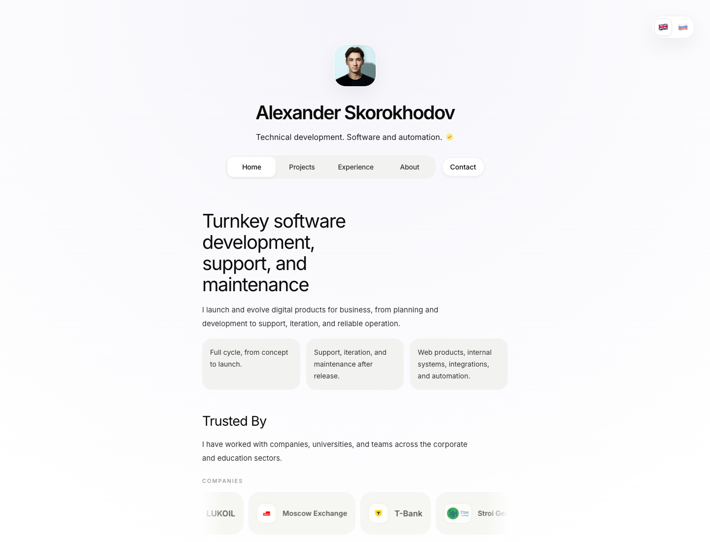
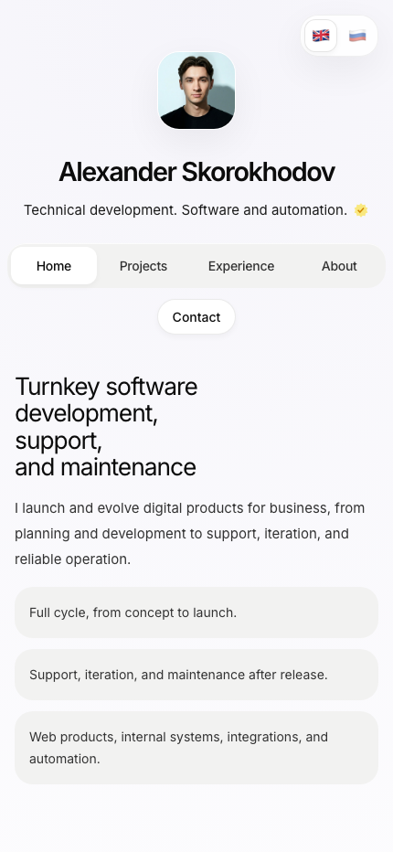

# Personal Card

Готовый шаблон персональной карточки-портфолио на `React + TypeScript + Vite`.

Подходит для:

- личного сайта специалиста;
- карточки фрилансера или агентства;
- портфолио разработчика, дизайнера, продакт-специалиста;
- лендинга с проектами, кейсами, контактами и картой опыта.

Сайт уже поддерживает:

- главную страницу;
- страницу проектов;
- страницу кейсов;
- страницу "Обо мне";
- детальные страницы проектов и кейсов;
- переключение `RU / EN`;
- форму связи через Telegram;
- карту с географией проектов.

## Скриншоты

Ниже быстрый визуальный обзор того, как выглядит сайт:

### Desktop



### Mobile



Полный набор скриншотов:

- [Главная, desktop](docs/screenshots/home-preview.png)
- [Проекты, desktop](docs/screenshots/projects-preview.png)
- [Кейсы, desktop](docs/screenshots/cases-preview.png)
- [Обо мне, desktop](docs/screenshots/about-preview.png)
- [Главная, mobile](docs/screenshots/home-mobile-preview.png)
- [Обо мне, mobile](docs/screenshots/about-mobile-preview.png)

## Быстрый старт

Требования:

- `Node.js 20+`
- `npm` или `pnpm`

Запуск локально:

```bash
npm install
npm run dev
```

Сборка production-версии:

```bash
npm run build
```

Предпросмотр production-сборки:

```bash
npm run preview
```

После запуска откройте адрес из терминала, обычно это `http://localhost:5173`.

## Что менять в первую очередь

Если вы хотите быстро заменить весь текущий профиль на свой, начните с этих файлов:

| Что меняется | Где менять |
| --- | --- |
| Имя, роль, аватар, email, Telegram username, ссылки на соцсети, подпись в футере | `src/content/site-data.ts` |
| Тексты главной, страницы проектов, кейсов, блока "Обо мне", карточек, формулировки CTA | `src/content/portfolio.ts` |
| Точки на карте проектов | `src/content/project-locations.ts` |
| Фото профиля | `public/square.jpeg` |
| Изображения проектов и кейсов | `public/projects/*` и `src/assets/hero.png` |
| Иконки соцсетей | `public/icons/social/*` |

## Настройка профиля

Основные личные данные находятся в `src/content/site-data.ts`.

Ищите объект `profile` для двух языков: `en` и `ru`.

Что там важно:

- `name` — имя на странице и в title вкладки.
- `role` — короткое описание под именем.
- `avatar` — путь к фото профиля.
- `email` — email в футере.
- `telegramUsername` — username для формы связи. Можно указывать с `@` или без.
- `footerLabel` и `footerNote` — нижняя строка сайта.

Соцсети лежат там же, в `aboutLinksByLocale`.

Пример:

```ts
profile: {
  name: 'Ivan Petrov',
  role: 'Frontend developer. Product websites and interfaces.',
  avatar: '/square.jpeg',
  email: 'ivan@company.com',
  telegramUsername: 'ivanpetrov',
  footerLabel: 'Ivan Petrov © 2026',
  footerNote: 'Open to freelance and product work.',
}
```

## Где лежит весь контент

Главный контент сайта собран в `src/content/portfolio.ts`.

Там находятся:

- тексты главной страницы;
- карточки проектов;
- карточки кейсов;
- фильтры кейсов;
- тексты страницы "Обо мне";
- workflow, домены, достижения;
- детальные страницы каждого проекта и кейса.

Это главный файл, если вы хотите заменить демо-контент на свой.

## Как заменить проекты

Для витрины проектов используйте массив `projects` в `src/content/portfolio.ts`.

У каждого проекта есть:

- `slug` — адрес страницы;
- `title` и `description` — название и описание;
- `category`, `status`, `location`;
- `ctaLabel`;
- `media` — обложка.

Чтобы проект открывался на отдельной странице, добавьте для него объект в `detailDefinitions` с `kind: 'project'`.

Минимальный порядок действий:

1. Добавьте картинку в `public/projects/`.
2. Обновите или создайте карточку в `projects`.
3. Добавьте детальную страницу в `detailDefinitions`.
4. Если проект должен быть на карте, добавьте точку в `src/content/project-locations.ts`.

## Как заменить кейсы

Для кейсов используются массивы:

- `cases` — карточки на странице кейсов;
- `selectedCaseSlugs` — кейсы, которые показываются на главной;
- `detailDefinitions` с `kind: 'case'` — полное описание кейса.

Чтобы заменить текущие примеры на свои:

1. Обновите карточку в `cases`.
2. Добавьте подробный разбор в `detailDefinitions`.
3. При необходимости включите кейс в `selectedCaseSlugs`.
4. Добавьте медиа в `public/projects/`.

## Карта проектов

Карта на странице "Обо мне" настраивается в `src/content/project-locations.ts`.

Для каждой точки можно задать:

- название;
- город;
- страну;
- год;
- тип задачи;
- ссылку;
- координаты.

Если карта не нужна, можно просто очистить массив `projectLocations`.

## Изображения и медиа

Что куда класть:

- `public/square.jpeg` — фото профиля;
- `public/projects/` — изображения для проектов и кейсов;
- `src/assets/hero.png` — запасное или общее hero-изображение;
- `public/icons/social/` — SVG-иконки соцсетей.

После добавления нового файла просто укажите путь к нему в контенте, например:

```ts
src: '/projects/my-project-cover.jpg'
```

## Два языка: RU и EN

Сайт работает на русском и английском. Во многих местах данные задаются сразу в двух версиях:

```ts
localized('English text', 'Русский текст')
```

или двумя объектами:

```ts
en: { ... }
ru: { ... }
```

Если второй язык вам пока не нужен, можно временно продублировать один и тот же текст в обе версии.

## Форма связи

Форма на странице "Обо мне" теперь отправляет данные на endpoint `/api/contact`.

Для работы нужны переменные окружения:

- `TELEGRAM_BOT_TOKEN`
- `TELEGRAM_CHAT_ID`
- `TELEGRAM_MESSAGE_THREAD_ID` — опционально, если используется topic в группе

Локально endpoint поднимается внутри `vite dev`, а для production можно использовать отдельный Node-процесс из `server-dist`.

## Production: Nginx + PM2

Если сайт раздаётся как статика через Nginx, а backend нужен только для формы, используйте такую схему:

1. Соберите проект:

```bash
npm install
npm run build
```

После этого появятся:

- `dist/` — фронтенд;
- `server-dist/` — маленький backend для `/api/contact`.

2. На сервере создайте `.env` рядом с проектом:

```bash
TELEGRAM_BOT_TOKEN=...
TELEGRAM_CHAT_ID=...
TELEGRAM_MESSAGE_THREAD_ID=...
```

3. Запустите backend через `pm2`:

```bash
pm2 start ecosystem.config.cjs
pm2 save
```

По умолчанию backend слушает `127.0.0.1:8787`.

4. В Nginx оставьте статику как есть, а `/api/contact` прокиньте в Node backend:

```nginx
location /api/contact {
    proxy_pass http://127.0.0.1:8787;
    proxy_http_version 1.1;
    proxy_set_header Host $host;
    proxy_set_header X-Real-IP $remote_addr;
    proxy_set_header X-Forwarded-For $proxy_add_x_forwarded_for;
    proxy_set_header X-Forwarded-Proto $scheme;
}

location / {
    root /var/www/personalcard/dist;
    try_files $uri $uri/ /index.html;
}
```

Если у вас уже есть рабочий Nginx для SPA, обычно достаточно добавить только `location /api/contact`.

## Структура страниц

Основные маршруты сайта:

- `/` — главная;
- `/projects` — проекты;
- `/experience` — кейсы;
- `/about` — обо мне.

Детальные страницы открываются автоматически по `slug`.

Примеры:

- `/projects/jewelry-saas`
- `/experience/fitment`

## Публикация

Проект готов к деплою как обычный Vite SPA.

Самый простой вариант:

1. Соберите проект командой `npm run build`.
2. Залейте репозиторий на GitHub.
3. Подключите его к Vercel.

Также можно использовать локально установленный CLI:

```bash
npx vercel
```

## Чеклист перед публикацией

- Заменено имя, роль и фото профиля.
- Обновлены соцсети и `telegramUsername`.
- Удалены или переписаны все демо-проекты и кейсы.
- Проверены тексты на `RU` и `EN`.
- Обновлена карта проектов.
- Выполнена команда `npm run build`.

## Полезно знать

- В проекте нет обязательных `.env`-переменных.
- Если `email` пустой, в футере показывается `footerNote`.
- Title страниц теперь берется из имени профиля, поэтому достаточно сменить `profile.name`.

## Лицензия

Используйте как основу для своей персональной карточки и адаптируйте под свой стиль, стек и контент.
